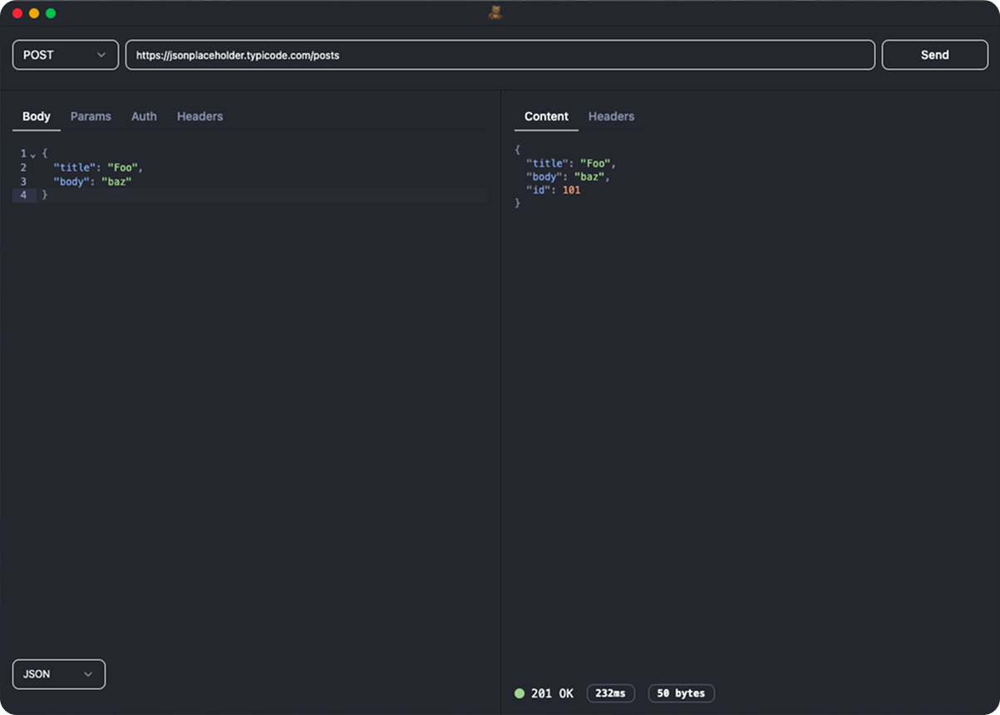

# Teddy

[](https://github.com/artmann/teddy/releases)
[](https://github.com/artmann/teddy/actions/workflows/build.yml)
[](https://github.com/artmann/teddy/actions/workflows/test.yml)
[](https://github.com/artmann/teddy/blob/main/LICENSE)
[](https://nodejs.org)
[](https://github.com/artmann/teddy/releases)

⚡️ A Blazing fast API client for macOS and Windows.



## Development

Install the dependencies:

```sh
bun install

```

Start the development server:

```sh
bun start

```

Run the tests:

```sh
bun run test

```

Format your code using Prettier:

```sh
bun format
```

## Building

### Build for Development

To create a packaged version of the app for testing:

```sh
bun package
```

This will create platform-specific packages in the `out/` directory.

### Build for Distribution

To create distributable installers/packages:

```sh
bun make
```

This will create platform-specific distributables (DMG for macOS, MSI for
Windows, etc.) in the `out/make/` directory.

### Build Requirements

- **Node.js**: Version 22.18.0 or higher
- **Bun**: Latest version
- **Platform-specific tools**:
  - **macOS**: Xcode Command Line Tools
  - **Windows**: Visual Studio Build Tools or Visual Studio Community
  - **Linux**: Build essentials (gcc, make, etc.)

### Cross-Platform Building

The build process automatically detects your platform and creates appropriate
packages:

- **macOS**: `.app` bundle and `.dmg` installer
- **Windows**: Executable and `.msi` installer
- **Linux**: AppImage, `.deb`, and `.rpm` packages

For more advanced build configuration, see `forge.config.ts`.
